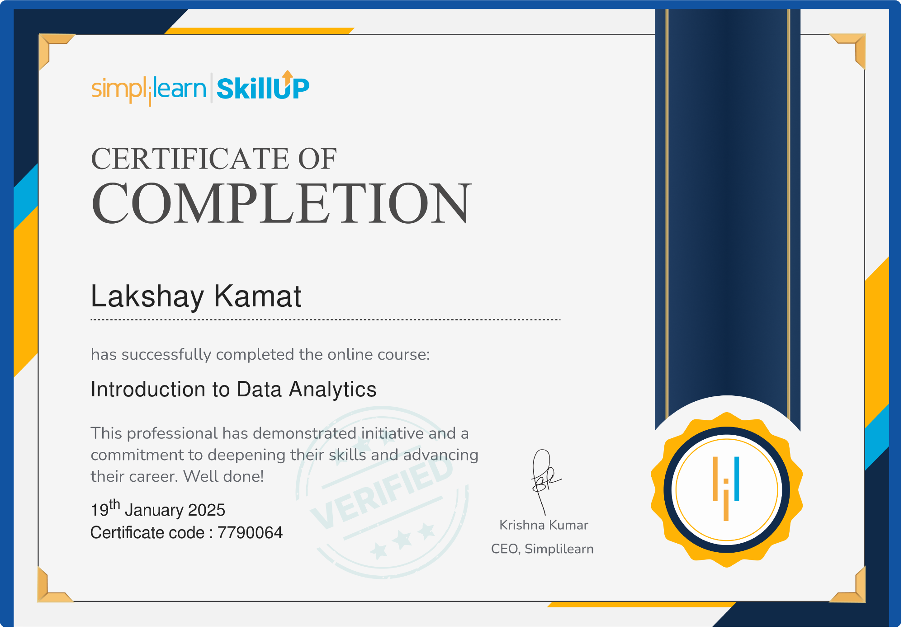
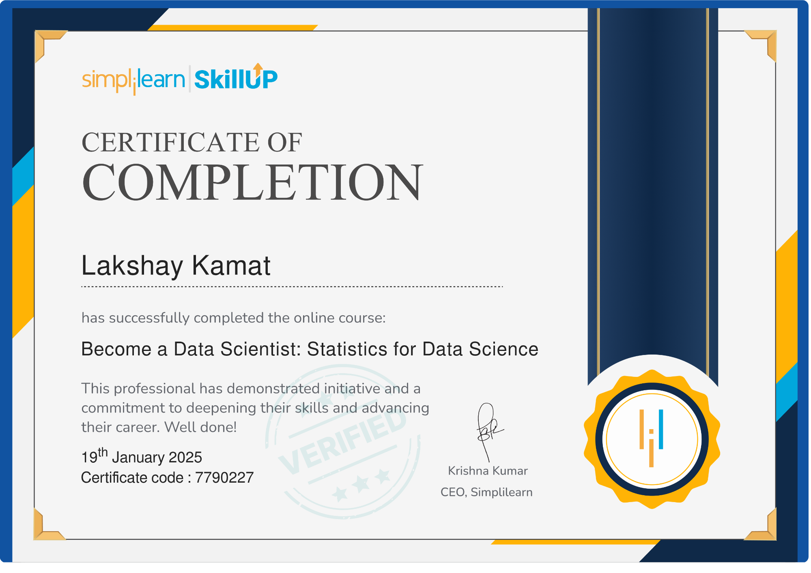

# 🌟 Professional Development & Certifications Portfolio

Welcome to my **Professional Development Portfolio**!  
This repository showcases my completed certifications, learning materials, and achievements across technical and professional domains. It reflects my dedication to continuous learning and growth.

## 🚀 Overview

📚 **Lifelong Learner:** Constantly exploring new tools, technologies, and concepts to enhance my professional skill set.  
🏆 **Certification Showcase:** A collection of accomplishments validating my expertise across various fields.  
🎯 **Skills Demonstrated:** Full-stack development, data analytics, business intelligence, and professional communication.

---

## 📜 Certifications

### 🧑‍💻 Data & Analytics

| **Certification**                 | **Issuer**      | **Preview**                                                                                                              | **Link**                                                                                                           |
| --------------------------------- | --------------- | ------------------------------------------------------------------------------------------------------------------------ | ------------------------------------------------------------------------------------------------------------------ |
| Introduction To Data Analytics | Simplilearn |  | [View Certificate](https://github.com/lakshaykamat/certifications/blob/main/Data%20Analytics%20-%20SL.pdf) |
| Statistics For Data Science | Simplilearn |  | [View Certificate](https://github.com/lakshaykamat/certifications/blob/main/Stats%20For%20DS%20-%20SL.pdf) |
| SQL Basic Level                   | HackerRank      |        | [View Certificate](https://github.com/lakshaykamat/certifications/blob/main/sql_basic%20-%20Hackerrank.pdf)        |
| SQL Intermediate Level            | HackerRank      |  | [View Certificate](https://github.com/lakshaykamat/certifications/blob/main/sql_intermediate%20-%20Hackerrank.pdf) |
| SQL Advanced Level                | HackerRank      |                                                                               | [View Certificate](https://github.com/lakshaykamat/certifications/blob/main/sql_advanced%20-%20Hackerrank.pdf)                                                                   |
| Power BI Beginner to Pro Workshop | Pragmatic Works |                                                                               | [View Certificate](https://github.com/lakshaykamat/certifications/blob/main/Power%20BI%20Beginner%20to%20Pro%20Workshop%20%20-%20Pragmatic%20Works.pdf)                                                                   |
| Excel Beginner to Pro             | Pragmatic Works |                                                                               | [View Certificate](https://github.com/lakshaykamat/certifications/blob/main/Excel%20Beginner%20to%20Pro%20-%20Pragmatic%20Works.pdf)                                                                   |
DAX Functions Workshop  | Pragmatic Works |  | [View Certificate](https://github.com/lakshaykamat/certifications/blob/main/DAX%20Functions%20Workshop%20-%20Pragmatic%20Works.pdf)
Power Auotamte Beginner to Pro | Pragmatic Works |  | [View Certificate](https://github.com/lakshaykamat/certifications/blob/main/Power%20Automate%20Beginner%20to%20Pro%20Workshop%20-%20Lakshay%20Kamat.pdf)
---

### 💻 Programming & Development

| **Certification**       | **Issuer**     | **Preview**                                 | **Link**                                         |
| ----------------------- | -------------- | ------------------------------------------- | ------------------------------------------------ |
| JavaScript Fundamentals | HackerRank     |  | [View Certificate](https://github.com/lakshaykamat/certifications/blob/main/javascript_basic%20-%20Hackerrank.pdf) |
| GitHub Learning Path    | Great Learning |  | [View Certificate](https://github.com/lakshaykamat/certifications/blob/main/Gituhb%20-%20Great%20Learning.pdf) |

---

### 🌐 Web Development & Design

| **Certification**     | **Issuer** | **Preview**                                 | **Link**                                          |
| --------------------- | ---------- | ------------------------------------------- | ------------------------------------------------- |
| React Basics          | HackerRank |  | [View Certificate](https://github.com/lakshaykamat/certifications/blob/main/react_basic%20-%20Hackerrank.pdf)  |
| UI Path Certification | UI Path    |  | [View Certificate](https://github.com/lakshaykamat/certifications/blob/main/UI%20Path.pdf)  |
| Digital Marketing     | COE        |  | [View Certificate](https://github.com/lakshaykamat/certifications/blob/main/Digital%20Marketing%20-%20COE.pdf) |

---

### 📢 Professional Skills

| **Certification**    | **Issuer** | **Preview**                                 | **Link**                                          |
| -------------------- | ---------- | ------------------------------------------- | ------------------------------------------------- |
| Communication Skills | COE        |  | [View Certificate](https://github.com/lakshaykamat/certifications/blob/main/Communication%20Skills%20-%20COE.pdf) |
| Soft Skills          | NPTEL      |  | [View Certificate](https://github.com/lakshaykamat/certifications/blob/main/Soft%20Skills%20-%20NPTEL%20.pdf) |

---

### 🏭 Industrial Experience

| **Certification**             | **Issuer** | **Preview**                                 | **Link**                                          |
| ----------------------------- | ---------- | ------------------------------------------- | ------------------------------------------------- |
| Entrepreneur Industrial Visit | NSIC       |  | [View Certificate](https://github.com/lakshaykamat/certifications/blob/main/Entrepreneur%20Industrial%20Visit%20-%20NSIC.pdf) |

---

## 🧠 Skills Acquired

Through these certifications, I’ve gained expertise in:

- 📊 **Data Analytics & Business Intelligence**: SQL, Power BI, DAX Functions
- 💻 **Full-stack Development**: JavaScript, React, GitHub
- 📈 **Marketing**: Digital Marketing Fundamentals
- 🎯 **Soft Skills**: Communication, Collaboration, and Presentation

---

## 🛠️ Tools & Technologies

- **Programming:** SQL, JavaScript, React
- **Business Intelligence:** Power BI, Excel, Power Automate
- **Collaboration:** GitHub

---

## 📝 Note

This repository is a reflection of my learning journey. Each certification validates my theoretical and practical understanding in respective domains.

---

_Last Updated: January 2025_
